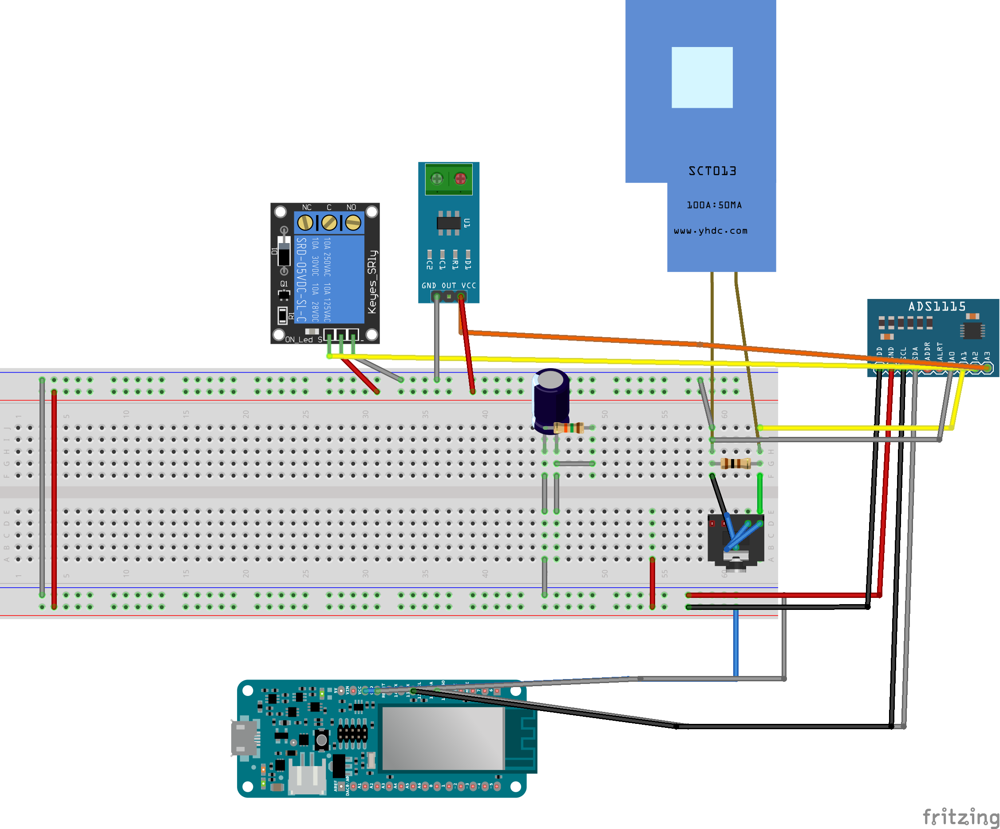

# ArduinoDeviceCode

## Visión General

Este codigo fuente tiene la vision de ser el ente para leer las lecturas del paso de energia electrica de una vivienda resiendencial. 
## Tecnologias Utilizadas

* [Arduino](https://www.arduino.cc/)
* [Arduino IDE](https://www.arduino.cc)
* [Visual Studio Code IDE](https://code.visualstudio.com/)
* [Github](https://github.com)
## Componentes Utilizados 
* [Arduino MKR 1000 Wifi](https://store.arduino.cc/usa/arduino-mkr1000 )
* [ADS1115](https://www.adafruit.com/product/1085)
* [SCT-013-030](https://www.amazon.com/Current-Sensor-SCT-013-030-Non-invasive-Transformer/dp/B074W38FLK
* [ACS712](https://www.sparkfun.com/datasheets/BreakoutBoards/0712.pdf)
* [ILI9341](https://cdn-shop.adafruit.com/datasheets/ILI9341.pdf)
* [Noyito 4 channel Solid State Relay](https://www.amazon.com/NOYITO-High-level-Automation-Industrial-Modification/dp/B07BLL4HFD)

## Configuracion del proyecto

1. Descarga e instala [Arduino](https://www.arduino.cc/)
2. Descarga e instala [Arduino IDE](https://www.arduino.cc)
3. Descarga e instala [Visual Studio Code IDE](https://code.visualstudio.com/).
4. Descarga e instala [GIT](https://git-scm.com/).
5. clona este repositorio [ArduinoDeviceCode](https://github.com/cb161769/ArduinoDeviceCode)
6. Abre el proyecto desde Arduino IDE
7. luego ejecuta el siguente 
script: `publish`
## Documentacion sobre calibracion de sensores 


para calibar los sensores tanto e, sensor ACS712, como el sensor CT SCT-030-30, se realizo el siguiente codigo: 

### Codigo de calibracion sensor ACS712

```cpp
float getVoltageTest() {
RunningStatistics inputStats;                 // create statistics to look at the raw test signal
  inputStats.setWindowSecs( windowLength );
   
  while( true ) {   
    sensorValue = analogRead(SENSOR_1);  // read the analog in value:
    inputStats.input(sensorValue);  // log to Stats function
        
    if((unsigned long)(millis() - previousMillis) >= printPeriod) {
      previousMillis = millis();   // update time
      
      // display current values to the screen
      
      // output sigma or variation values associated with the inputValue itsel
     
      // convert signal sigma value to current in amps
      current_amps = intercept + slope * inputStats.sigma();
     return current_amps;
    }
  }

}

```
### Codigo de calibracion de sensor SCT 

```cpp
float getCurrent() {
  float Volt_diferencial;
  float current;
  float sum = 0;
  long times = millis();
  int counter = 0;
  while (millis() - times < 1000)
  {
    Volt_diferencial = ads.readADC_Differential_0_1() * multiplier;
    current = Volt_diferencial * FACTOR;
    current /= 1000.0;

    sum += sq(current);
    counter = counter + 1;
  }
  current = sqrt(sum / counter);
  return (current);


}

```